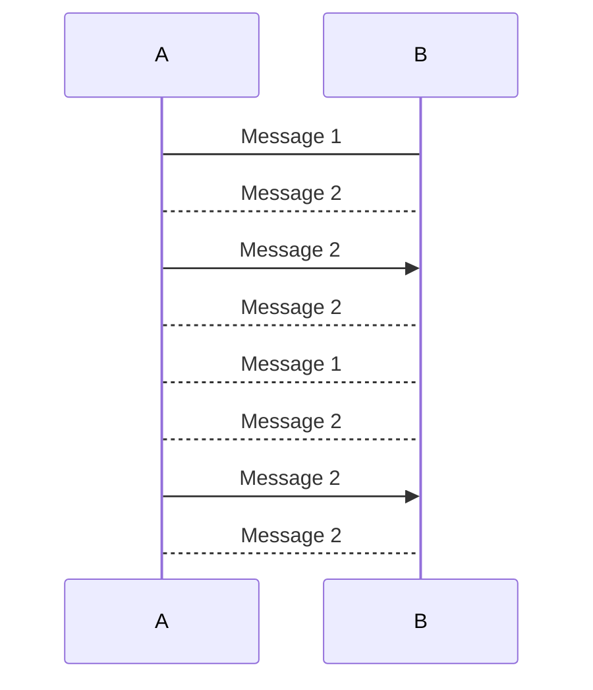
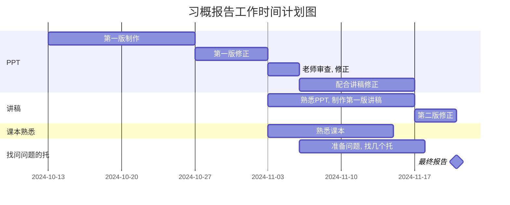

# MarkDown 语法的学习

<span style='color:white;background:black;font-size:50px;font-family:华文新魏;'>文字示例</span>

## 目录

打上[TOC],自行创建目录,大小写随意

[toc]

## 标题

### 三级标题

#### 四级标题

##### 五级标题

###### 六级标题

####### 没有七级标题

## 页内跳转

[转到列表](#列表)

[转到正则表达式的用正则表达式判断邮箱正确](Day14-正则表达式#用正则表达式判断邮箱正确). 这个就不好用了

## 字体

*斜体*

**粗体**

==黄色标注==

==黄色标注的**粗体**==

***既斜又粗***

~~划去~~

可以有~下标~

也可以有^上标^

奇妙的~~^混合^~~

## 引用

> 这里用来放引用了的话

## 分割线

---

***

## 插入图片

这是一个本地图片文件：


这是一个网页图片文件(转自https://i0.hdslb.com/bfs/new_dyn/5af0ddea6370c05b54e36a5bfa63b91e168687092.jpg)：


## 超链接

[这是一个超链接，点击跳转到课程目录](https://www.kuangstudy.com/course?cid=1)

[又是一个超链接，尝试能不能链接到本地文件夹，看来可行](.)

## 列表

1. 这是有序列表
2. 就是前面有序号的
3. 用1+.+空格召唤
4. 回车会自动下一行的序号
5. 连续两次回车退出列表

- 这是无序列表
- 就是前面无序号的
- 用-+空格召唤
- 其余同上
    - 还能用tab键换到次等级
        - 还能再换
            - 不行了

## 表格

姓名|性别|年龄|出生日期
--|--|--|--
帅哥|女|5|2023.8.1

也可以右键直接插入一个列表

## 程序

`print("hello")`

```python
while True:
	print("fuck")
```

```c
int a=2
printf("a=%d",a)
```

## mermaid

[Mermaid](https://zhuanlan.zhihu.com/p/627356428)





## 数学公式

[MarkDown数学公式](https://zhuanlan.zhihu.com/p/441454622)

[Markdown 数学公式详细总结](https://zhuanlan.zhihu.com/p/679557799#:~:text=Markdown 中的数学公式也分为「行中公式」和「独立公式」两种。 1.行内公式%3A将公式插入到本行内，符号%3A %24公式内容 %24,，如%3A xyz 2.独行公式%3A将公式插入到新的一行内，并且居中，符号%3A %24%24公式内容%24%24 如%3A)
$$
score(Q,d) = \sum_i^n{
	[ \log(1+\frac{N-n+0.5}{n+0.1})
	\times 
	\frac{f_i}{f_i+k_i \cdot (1-b+b \cdot \frac{dl}{avgdl} )}]
}\\
BM25算法
$$

