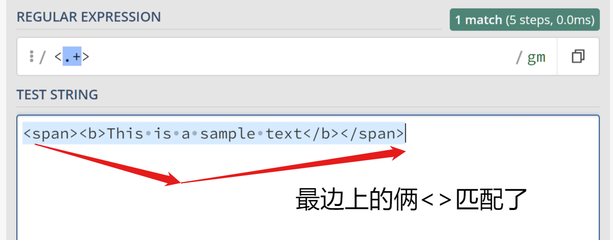
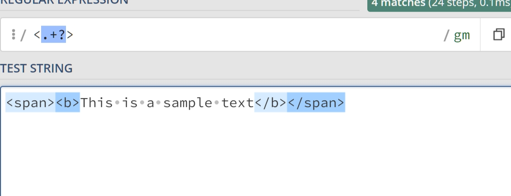
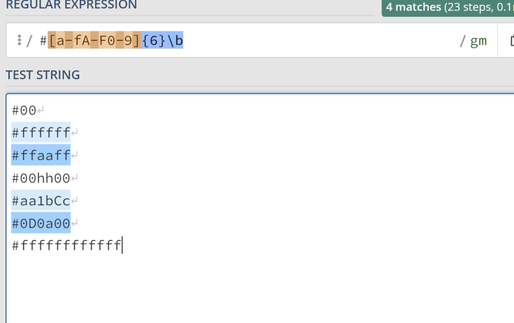

# 正则表达式(regex)

## 文本输入

直接输入文本查找字符

## 限定符


| 符号      | 作用                                             | 示例      | 适配结果                      |
| --------- | ------------------------------------------------ | --------- | ----------------------------- |
| ?         | ?前的字符出现0次或者1次                          | used?     | use，used                     |
| (?i)      | 忽略大小写                                       | ((?i)ab)c | abc,Abc,aBc,ABc               |
| *         | *前的字符出现0次或多次                           | ab*c      | ac，abc，abbc，abbbbbbc...... |
| +         | +前的字符出现1次或多次                           | ab*c      | abc，abbc，abbbbbbc......     |
| {...}     | {...}内的数字指定字母出现的次数                  | ab{6}c    | abbbbbbc                      |
| {...,...} | {...,...}内的两个数字指定字母次数的范围,左闭右闭 | ab{2,3}c  | abbc,abbbc                    |
| {...,}    | {...,}省略右边则表示只指定下限,不设上限          | a{2,}c    | abbc，abbbc,abbbbbbc......    |
| {,...}    | {,...}没有省略左边的写法                         |           |                               |

## （）

| 符号 | 作用               | 示例  | 适配结果           |
| ---- | ------------------ | ----- | ------------------ |
| ()   | 打包字符组成字符串 | (ab)+ | ab,abab,ababab.... |

## 或运算

| 符号 | 作用     | 示例         | 适配结果    |
| ---- | -------- | ------------ | ----------- |
| \|   | 或运算符 | a (cat\|dog) | a cat,a dog |
| \|   | 或运算符 | a cat\|dog   | a cat,dog   |

## 字符类

| 符号             | 作用                                       | 示例   | 适配结果   |
| ---------------- | ------------------------------------------ | ------ | ---------- |
| [...]            | 指定特定字符构成的单词                     | [abc]+ | abc,ac,bac |
| [a-z]            | 所有小写英文字符                           |        |            |
| [d-f]            | d，e，f                                    |        |            |
| [A-Z]            | 所有大写英文字符                           |        |            |
| [0-9]            | 所有数字字符                               |        |            |
| [a-zA-Z]         | 所有英文字符                               |        |            |
| ^[...]，[ ^....] | **除**指定字符**外**的一切字符，包含换行符 |        |            |

## 元字符

| 符号 | 作用                            | 适配结果  |
| ---- | ------------------------------- | --------- |
| \b   | 末尾加上\b表示字符边界          |           |
| \d   | 数字字符                        | 1，14，12 |
| \w   | 英文字符+数字字符+下划线        |           |
| \s   | 空白符（包含Tab和换行符）       |           |
| \D   | 非数字字符                      |           |
| \W   | 非（英文字符+数字字符+下划线）  |           |
| \S   | 非【空白符（包含Tab和换行符）】 |           |
| \.   | 不包含换行符的任意字符          |           |
| \\.  | .号                             |           |


| 符号     | 作用                      | 适配结果 |
| -------- | ------------------------- | -------- |
| \\\n和\n | 在Pattern regex里是一样的 |          |
|          |                           |          |
|          |                           |          |


## 特殊字符

| 符号 | 作用     | 示例 | 适配结果            |
| ---- | -------- | ---- | ------------------- |
| ^    | 匹配行首 | ^a   | **只**会匹配行首的a |
| $    | 匹配行尾 | a$   | **只**会匹配行尾的a |

## 贪婪和懒惰匹配

+{ }*在匹配字符串时默认回去匹配尽可能多的字符(Greedy Match)




那么只需在+后加上？即可(Lazy Match)




## 示例

### 颜色匹配



### IPv4 地址匹配

```regex
\b((25[0-5]|2[0-4]\d|[01]?\d\d?)\.){3}(25[0-5]|2[0-4]\d|[01]?\d\d?)\b
```

## 正则表达式与JAVA

``` java
待判断的字符串.matcher("正则表达式")
```

### 用正则表达式判断邮箱正确

```java
public static boolean checkEmail(String email){
    return email.matches( "\\w{2,}"+ "@" +"\\w{2,20}(\\.\\w{2,20})+");//注意\.代表任意字符
    //------------------------------------------------------------+表示出现一次或多次
    //matche(匹配)
}
```

### 用正则表达式在文本中查找

```java
public static ArrayList findSomething(String text){
    ArrayList<String> strings = new ArrayList<>();
    //regex
    String regex = "\\d";
    //把regex封装成一个pattern(模式)对象
    Pattern pattern = Pattern.compile(regex);
    //通过pattern得到查找内容的matcher(匹配器)
    Matcher matcher = pattern.matcher(text);
    //通过匹配器开始去内容中查找信息
    while(matcher.find()){//找到了返回true,找完了返回false
        strings.add(matcher.group());
        System.out.println(matcher.group());
    }
    return strings;
}
```

### 用正则表达式在文本中替换

```java
public static String changeStutter(String text){//stutter,口吃
    text = text.replaceAll("\\d+" ,"x");
    return text;
}
```


### 口吃替换

```java
public static String changeStutter(String text){//stutter,口吃
    //要把一个口吃的人说的:
    //我我我我我我喜欢欢欢欢欢欢欢欢欢欢欢欢编编编编编编编编编编编编编编编程程程程
    //改成:
    //我喜欢编程
    text = text.replaceAll("(.)\\1+" ,"$1");
    /*
    (.) : 表示一组
    \\1 : 为这个组声明了一个组号
    + : 声明必须是重复的字
    $1 : 取到组 1 代表的拿分重复字符
     */
    return text;
}
```

