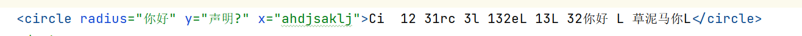

# 仅含文本

>Text-Only 

仅包含简易的内容（文本和属性）

## 声明

添加`simpleContent`进行声明

当使用简易内容时，就必须在 `simpleContent` 元素内定义扩展(`extension `)~~或限定(`restriction `)~~，来扩展~~或限制~~元素的基本简易类型

### 扩展

```xml
<xs:element name="circle">
    <xs:complexType>
        <xs:simpleContent>
            <xs:extension base="xs:string">
                <xs:attribute name="x" type="xs:double"/>
                <xs:attribute name="y" type="xs:double"/>
                <xs:attribute name="radius" type="xs:double"/>
            </xs:extension>
        </xs:simpleContent>
    </xs:complexType>
</xs:element>
```

```xml
<circle x="4" y="3" radius="5">
    这是一个圆
</circle>
```

## 问题

定义xsd声明下面的元素

```xml
<!--元素内的值`CircleA` 要求全英文, 无数字无空白符, 可大小写-->
<circle radius="12" y="2" x="2">CircleA</circle>
```

答?

```xml
<xs:element name="circle">
    <xs:complexType>
        <xs:simpleContent>
            <xs:restriction base="xs:string">
                <xs:pattern value="[A-Za-z]+"/>
                <xs:attribute name="x" type="xs:double"/>
                <xs:attribute name="y" type="xs:double"/>
                <xs:attribute name="radius" type="xs:double"/>
            </xs:restriction>
        </xs:simpleContent>
    </xs:complexType>
</xs:element>
```



