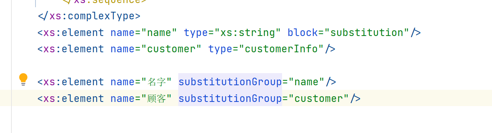
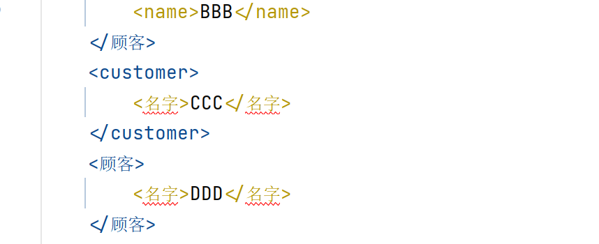

# 元素替换

>Element Substitution

一个元素对另一个元素进行替换

新定义一个名字不一样的元素, 可以完全替换另一个元素的位置, 它们的区别仅仅只有名字不而已

## 需求

使用schema的程序员, 来自英国和China! 我们希望有能力让用户选择在 XML 文档中使用China! 语的元素名称还是英语的元素名称。

## 属性`substitutionGroup`

定义一个 *substitutionGroup*, 声明主元素(NAME)，次元素(name)，

次元素声明它们能够替换的主元素

```xml
<xs:schema xmlns:xs="http://www.w3.org/2001/XMLSchema"
           targetNamespace="http://www.harvey.com/schema/perosn"
           xmlns="http://www.harvey.com/schema/perosn"
           elementFormDefault="qualified">
    <!--一定要放在最外层-->
    <xs:element name="NAME" type="xs:string"/>
    <xs:element name="name" substitutionGroup="NAME"/>

    <!--...-->
</xs:schema>
```

可替换元素的类型必须和主元素相同，或者从主元素衍生而来。

substitutionGroup 中的所有元素（主元素和可替换元素）必须被声明为**全局元素**

## 使用

```xml
<?xml version="1.0" encoding="UTF-8" standalone="no"?>

<xs:schema xmlns:xs="http://www.w3.org/2001/XMLSchema"
           targetNamespace="http://www.harvey.com/schema/perosn"
           xmlns="http://www.harvey.com/schema/perosn"
           elementFormDefault="qualified">
    <xs:element name="persons" type="personsType"/>
    <xs:complexType name="personsType">
        <xs:sequence>
            <xs:element ref="customer" minOccurs="0" maxOccurs="unbounded"/>
        </xs:sequence>
    </xs:complexType>

    <xs:complexType name="customerInfo">
        <xs:sequence>
            <xs:element ref="name"/>
        </xs:sequence>
    </xs:complexType>
    <xs:element name="name" type="xs:string"/>
    <xs:element name="customer" type="customerInfo"/>

    <xs:element name="名字" substitutionGroup="name"/>
    <xs:element name="顾客" substitutionGroup="customer"/>

</xs:schema>
```

```xml
<?xml version="1.0" encoding="UTF-8"?>
<persons xmlns="http://www.harvey.com/schema/perosn"
         xmlns:xsi="http://www.w3.org/2001/XMLSchema-instance"
         xsi:schemaLocation="http://www.harvey.com/schema/perosn person.xsd">
    <customer>
        <name>AAA</name>
    </customer>
    <顾客>
        <name>BBB</name>
    </顾客>
    <customer>
        <名字>CCC</名字>
    </customer>
    <顾客>
        <名字>DDD</名字>
    </顾客>
</persons>
```

## 阻止元素替换

防止其他的元素替换某个指定的元素，使用 *block* 属性

```xml
<xs:element name="name" type="xs:string" block="substitution"/>
```



看似一切安好



其实已经不生效了

